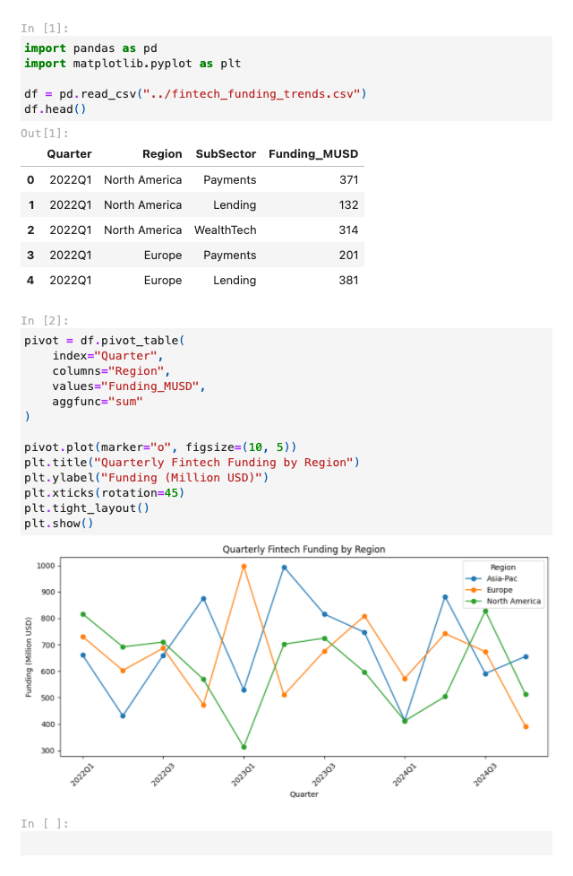

# 📊 Financial Infographic Datasets

[](https://github.com/henryegesa/financial-infographic-datasets/actions/workflows/infographic-build.yml)
[](LICENSE)
[](#datasets)
[](https://www.python.org/)

---

## 🚀 Sample Infographic

{:style="max-width:600px; border:1px solid #ddd; border-radius:4px;"}

> **Tip:** If you don’t yet have `fintech_funding_overview.png`, run:
> ```bash
> jupyter nbconvert \
>   --to png \
>   --execute notebooks/fintech_funding_overview.ipynb \
>   --output fintech_funding_overview.png \
>   --output-dir infographics
> ```

---

## 📂 Datasets

| File                                  | Description                              | Format |
|---------------------------------------|------------------------------------------|--------|
| `fintech_funding_trends.csv`          | Quarterly funding by fintech sub-sector  | CSV    |
| `bnpl_revenue_by_provider.csv`        | Revenue split among BNPL providers       | CSV    |
| `corporate_cash_balances.xlsx`        | Top 200 corporates’ cash positions       | XLSX   |
| `working_capital_index.xlsx`          | Working capital index across industries  | XLSX   |
| `wacc_by_sector.csv`                  | Sector-level WACC metrics                | CSV    |
| `roic_margins_by_industry.csv`        | ROIC margins by industry                 | CSV    |

*Click the “Build Infographics” badge above to regenerate the HTML/PNG infographic whenever you update the data.*
